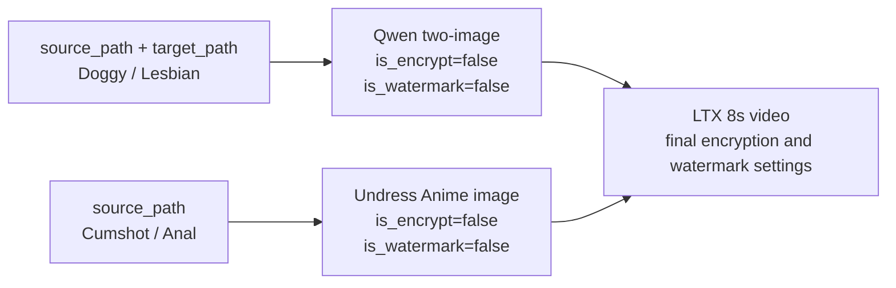

# FlowBridge

FlowBridge runs async workflow aggregation tasks and exposes bridge-owned task status.

## Run

Edit `config.json` first:

```json
{
  "addr": ":8080",
  "backend_base_url": "http://your-backend:8000",
  "db_path": "flowbridge.db",
  "worker_concurrency": 8,
  "worker_queue_size": 10000,
  "max_runnable_tasks": 10000,
  "max_submit_retries": 8,
  "max_poll_errors": 10,
  "max_task_not_found": 60,
  "poll_interval": "3s",
  "request_timeout": "15s",
  "task_timeout": "30m",
  "http_timeout": "30s"
}
```

Then start:

```bash
go run .
```

## Docker Compose

```bash
docker compose up -d --build
```

The service listens on:

```text
http://127.0.0.1:8080
```

SQLite data is persisted under:

```text
Docker volume: flowbridge-data
```

Do not use `docker compose down -v` unless you intentionally want to delete the DB volume.

## Smoke Tests

Lightweight service health test:

```bash
FLOWBRIDGE_BASE_URL=https://your-flowbridge-domain \
COUNT=30 \
CONCURRENCY=5 \
bash scripts/smoke_health.sh
```

Small real workflow test:

```bash
FLOWBRIDGE_BASE_URL=https://your-flowbridge-domain \
FLOWBRIDGE_APIKEY=your-user-api-key \
COUNT=5 \
CONCURRENCY=2 \
bash scripts/workflow_smoke.sh
```

Keep `COUNT` and `CONCURRENCY` small for production smoke tests. The workflow test submits real backend jobs.
Both scripts also accept `CURL_CONNECT_TIMEOUT` and `CURL_MAX_TIME`; every probe is bounded so a broken connection cannot hang the smoke run.

`task_timeout` is a hard end-to-end deadline measured from task creation and is preserved across retries and service restarts. Non-positive values fall back to `30m`, so a stalled upstream task cannot occupy a worker forever. Increase it explicitly if valid workflows can take longer. On the first upgrade from a database without deadline metadata, existing runnable tasks are given one fresh timeout window rather than failed retroactively.

`request_timeout` applies a deadline to API and admin request contexts, including time waiting for SQLite, so cooperative request work does not remain stuck indefinitely.

`max_runnable_tasks` caps the combined pending/running backlog (default `10000`). New submissions receive HTTP 503 plus `Retry-After` when that limit is reached, protecting SQLite from unbounded overload. Override it with `FLOWBRIDGE_MAX_RUNNABLE_TASKS` after sizing the deployment.

`max_submit_retries` controls retries for temporary backend submit failures such as HTTP 429 and 5xx responses. Ambiguous outcomes (5xx, network interruption, or an unreadable success response) are checked by the stable backend step `task_id` before any retry; explicit non-retryable 4xx responses still fail fast.

The workflow smoke script defaults to this request shape:

```bash
curl --location 'http://43.213.13.89:7070/api/public/generate/undress/anime/video' \
  --header 'Accept: application/json' \
  --header 'Content-Type: application/x-www-form-urlencoded' \
  --header 'Apikey: your-user-api-key' \
  --data-urlencode 'source_path=http://allenflux.tech:8000/files/44e8e840819be8e0638087a2.jpg' \
  --data-urlencode 'title=auto generated curl' \
  --data-urlencode 'fee=10' \
  --data-urlencode 'incoming_prompt=' \
  --data-urlencode 'scene_name=goal_kick_portugal' \
  --data-urlencode 'output_format=video'
```

Use another config file:

```bash
FLOWBRIDGE_CONFIG=/path/to/config.json go run .
```

Environment variables still override the config file when set.

## APIs

Submit anime image-to-video workflow:

```text
POST /api/public/generate/undress/anime/video
```

Pass the user's backend API key on each request:

```bash
curl --location 'http://127.0.0.1:8080/api/public/generate/undress/anime/video' \
  --header 'Accept: application/json' \
  --header 'Content-Type: application/x-www-form-urlencoded' \
  --header 'Apikey: your-user-api-key' \
  --data-urlencode 'source_path=http://allenflux.tech:8000/files/44e8e840819be8e0638087a2.jpg' \
  --data-urlencode 'title=auto generated curl' \
  --data-urlencode 'fee=10' \
  --data-urlencode 'incoming_prompt=' \
  --data-urlencode 'scene_name=venom_transform' \
  --data-urlencode 'video_scene_name=disney_real_anime_greet' \
  --data-urlencode 'output_format=video'
```

### Dedicated one-to-one 10Eros image-to-video API

The four 10Eros pipelines use a separate FlowBridge endpoint:

```text
POST /api/public/generate/10eros/image-to-video
```

See the [Chinese API guide](docs/10eros-image-to-video-api.md) and the [YApi-importable Swagger file](docs/flowbridge-10eros-openapi.json) for the complete contract.

Do not submit these four scenes to the legacy `/api/public/generate/undress/anime/video` route. That route remains dedicated to the original anime-undress workflow and rejects 10Eros scenes with a pointer to the new endpoint.

The dedicated endpoint orchestrates these scene-specific pipelines:

| `scene_name` | Image step | Video step |
| --- | --- | --- |
| `gay_doggy_10eros` | `/api/public/generate/qwen/two-image` | `/api/public/generate/videos/scenes/8s/ltx` |
| `gay_cumshot_10eros` | `/api/public/generate/undress/anime` | `/api/public/generate/videos/scenes/8s/ltx` |
| `gay_anal_creampie_10eros` | `/api/public/generate/undress/anime` | `/api/public/generate/videos/scenes/8s/ltx` |
| `lesbian_kiss_10eros` | `/api/public/generate/qwen/two-image` | `/api/public/generate/videos/scenes/8s/ltx` |

For these four scenes, the image and video scene names are locked one-to-one. Omit `video_scene_name`, or pass the same value as `scene_name`. Both `gay_doggy_10eros` and `lesbian_kiss_10eros` require `target_path` for the second input image.



The extended parameters are:

- `qwen_incoming_prompt`: image-step prompt; falls back to `incoming_prompt`.
- `wan_incoming_prompt`: LTX video-step prompt; falls back to `incoming_prompt`.
- `audio_enabled`: LTX audio switch, default `true`; explicit `false` is preserved.
- `video_format`: `video/h264-mp4` (default) or `video/h265-mp4`.
- `is_encrypt`: controls the final video. The intermediate image is always explicitly unencrypted so its URL can be consumed by LTX. This also applies to the Qwen two-image route's new encryption parameter.
- `is_watermark` (alias `watermark`): controls only the final video and defaults to `true`. Every intermediate image is explicitly generated with `is_watermark=false`, so a watermark is never applied twice.
- `bid`, `app_id`, `fee`, `title`, and `hash_key` are forwarded where the selected backend endpoint supports them.
- For these composed scenes, `notify_url` is sent only to the final LTX step, avoiding an intermediate-image callback followed by a second video callback.

Two-image example:

```bash
curl --location 'http://127.0.0.1:8080/api/public/generate/10eros/image-to-video' \
  --header 'Accept: application/json' \
  --header 'Content-Type: application/x-www-form-urlencoded' \
  --header 'Apikey: your-user-api-key' \
  --data-urlencode 'source_path=https://example.com/person-1.jpg' \
  --data-urlencode 'target_path=https://example.com/person-2.jpg' \
  --data-urlencode 'scene_name=lesbian_kiss_10eros' \
  --data-urlencode 'qwen_incoming_prompt=' \
  --data-urlencode 'wan_incoming_prompt=' \
  --data-urlencode 'audio_enabled=true' \
  --data-urlencode 'is_watermark=true' \
  --data-urlencode 'is_encrypt=false' \
  --data-urlencode 'video_format=video/h264-mp4'
```

Query bridge task:

```text
GET /api/public/task?task_id=bridge_xxx
POST /api/public/task
POST /api/public/task/details
```

Batch query uses the same root JSON-array contract as the backend public API, with at most 1,000 task IDs per request. Results follow the first occurrence of each requested task ID; unknown IDs are omitted unless none of the requested tasks exist. Combined stored result payloads are capped at 32 MiB per response to prevent memory amplification; oversized batches return HTTP 413 and should be split.

```bash
curl --location 'http://127.0.0.1:8080/api/public/task/details' \
  --header 'Accept: application/json' \
  --header 'Content-Type: application/json' \
  --header 'Apikey: your-user-api-key' \
  --data '["bridge_task_a", "bridge_task_b"]'
```

Admin console:

```text
/admin/workflows
/admin/workflows/{task_id}
```

The tab favicon is the unmodified Bootstrap Icons `arrow-left-right` SVG, embedded locally so the icon does not depend on a CDN at request time. Its MIT notice is in `static/BOOTSTRAP-ICONS-LICENSE`.

Liveness and readiness probes:

```text
GET /healthz
GET /readyz
```

`/readyz` verifies SQLite access and reports whether submissions are being accepted, the configured runnable-task ceiling, runnable task count, worker count, and in-memory queue depth/capacity. Docker Compose uses this endpoint for its bounded health check.

## Reliability Notes

- Submitted tasks are persisted to SQLite before worker execution.
- Each backend step gets a stable derived `task_id`; a recovered running step checks for an already accepted backend task before submitting again.
- Worker queue overflow does not block requests; pending tasks are recovered from DB, while the durable runnable backlog is capped by `max_runnable_tasks`.
- Worker and HTTP handlers recover from panics and return/record failures.
- Backend `status=2` means success, `status=-1` means failed, and `status=3` keeps polling. Missing or unknown statuses fail after `max_poll_errors` instead of polling forever.
- Worker retries share the persisted task-creation deadline. Existing runnable tasks are grandfathered once when the deadline column is introduced.
- Shutdown cancels workers while HTTP requests drain, waits within one bounded budget, and Docker Compose grants a 35-second stop window before forcing termination.
- Tune `FLOWBRIDGE_WORKERS` carefully because each worker can hold one backend workflow while polling.
