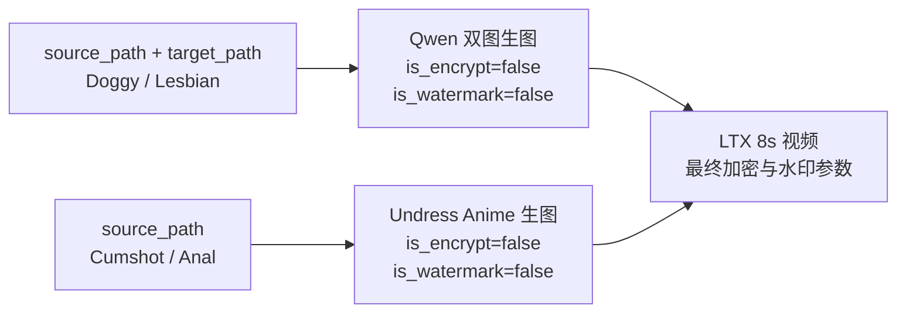

# FlowBridge 10Eros 先生图再生视频接口

## 新旧入口区分

| 用途 | FlowBridge 路由 | 说明 |
| --- | --- | --- |
| 新：4 个 10Eros 一一对应组合工作流 | `POST /api/public/generate/10eros/image-to-video` | 本文档描述的接口 |
| 旧：原有 Anime Undress 组合工作流 | `POST /api/public/generate/undress/anime/video` | 不再接收下面 4 个 10Eros 场景 |

四个 10Eros 场景必须使用新入口。误传到旧入口时返回 HTTP 400，并在错误信息中提示新路由。

## 编排关系



| `scene_name` | 第一步：生图路由 | 输入图片 | 第二步：视频路由 |
| --- | --- | --- | --- |
| `gay_doggy_10eros` | `/api/public/generate/qwen/two-image` | `source_path` + `target_path` | `/api/public/generate/videos/scenes/8s/ltx` |
| `lesbian_kiss_10eros` | `/api/public/generate/qwen/two-image` | `source_path` + `target_path` | `/api/public/generate/videos/scenes/8s/ltx` |
| `gay_cumshot_10eros` | `/api/public/generate/undress/anime` | `source_path` | `/api/public/generate/videos/scenes/8s/ltx` |
| `gay_anal_creampie_10eros` | `/api/public/generate/undress/anime` | `source_path` | `/api/public/generate/videos/scenes/8s/ltx` |

> Doggy 已从旧的单图生图路由迁移到 Qwen 双图生图路由，调用方式与 `lesbian_kiss_10eros` 相同。Qwen 底层虽然使用三图母工作流，但公开路由仍只需要两张输入图；第三张图沿用母工作流默认值，不需要客户端传入。

## 提交任务

```text
POST https://flowbridge.inaiai.com/api/public/generate/10eros/image-to-video
Content-Type: application/x-www-form-urlencoded
Apikey: <用户 API Key>
```

### 请求 Header

| 参数 | 必填 | 说明 |
| --- | --- | --- |
| `Apikey` | 是 | 用户后端 API Key；FlowBridge 会透传到每一步后端任务 |
| `Content-Type` | 是 | YApi 与本文档统一使用 `application/x-www-form-urlencoded` |
| `Accept` | 否 | 推荐 `application/json` |

### 请求参数

| 参数 | 类型 | 必填 | 默认值 | 说明 |
| --- | --- | --- | --- | --- |
| `source_path` | string | 是 | - | 第一张输入图片 URL |
| `target_path` | string | 条件必填 | - | Doggy、Lesbian 必填；Cumshot、Anal 不使用 |
| `scene_name` | string | 是 | - | 仅支持上表 4 个值 |
| `video_scene_name` | string | 否 | 与 `scene_name` 相同 | 建议省略；如果传入，必须与 `scene_name` 一致 |
| `incoming_prompt` | string | 否 | 空 | 生图和视频共用的兜底提示词 |
| `qwen_incoming_prompt` | string | 否 | `incoming_prompt` | 第一步生图提示词 |
| `wan_incoming_prompt` | string | 否 | `incoming_prompt` | 第二步 LTX 视频提示词 |
| `audio_enabled` | boolean | 否 | `true` | LTX 音频开关；显式传 `false` 会保留 |
| `video_format` | string | 否 | `video/h264-mp4` | 支持 `video/h264-mp4`、`video/h265-mp4` |
| `is_watermark` | boolean | 否 | `true` | 只控制最终视频水印；兼容别名 `watermark` |
| `is_encrypt` | boolean | 否 | `false` | 只控制最终视频加密 |
| `bid` | string | 否 | 空 | 业务编号 |
| `app_id` | string | 否 | 空 | 应用编号 |
| `fee` | string | 否 | `10` | 费用参数 |
| `title` | string | 否 | 空 | 任务标题 |
| `hash_key` | string | 否 | 空 | 只向支持该字段的后端步骤透传；Qwen 双图步骤由 Apikey 自动计算 |
| `notify_url` | string | 否 | 空 | 只发送给最终 LTX 步骤，避免中间图和最终视频重复回调 |
| `task_id` | string | 否 | 自动生成 | FlowBridge 对外任务 ID；建议由调用方提供唯一值，便于幂等查询 |

### 水印与加密规则

- 第一步中间图固定发送 `is_encrypt=false` 和 `is_watermark=false`。
- 最终 LTX 视频才发送调用方的 `is_encrypt` 和 `is_watermark`。
- `is_watermark` 未传时，最终视频默认开启水印；显式传 `false` 时整个组合流程均不加水印。
- 该规则避免中间图先加水印、最终视频再次加水印。

### 双图场景请求示例

Doggy 与 Lesbian 使用同一请求结构：

```bash
curl --location 'https://flowbridge.inaiai.com/api/public/generate/10eros/image-to-video' \
  --header 'Accept: application/json' \
  --header 'Content-Type: application/x-www-form-urlencoded' \
  --header 'Apikey: <用户 API Key>' \
  --data-urlencode 'source_path=https://example.com/person-1.jpg' \
  --data-urlencode 'target_path=https://example.com/person-2.jpg' \
  --data-urlencode 'scene_name=gay_doggy_10eros' \
  --data-urlencode 'audio_enabled=true' \
  --data-urlencode 'video_format=video/h264-mp4' \
  --data-urlencode 'is_watermark=true' \
  --data-urlencode 'is_encrypt=false' \
  --data-urlencode 'task_id=smoke_gay_doggy_10eros_001'
```

把 `scene_name` 改为 `lesbian_kiss_10eros` 即可测试女同场景。

### 单图场景请求示例

```bash
curl --location 'https://flowbridge.inaiai.com/api/public/generate/10eros/image-to-video' \
  --header 'Accept: application/json' \
  --header 'Content-Type: application/x-www-form-urlencoded' \
  --header 'Apikey: <用户 API Key>' \
  --data-urlencode 'source_path=https://example.com/person.jpg' \
  --data-urlencode 'scene_name=gay_cumshot_10eros' \
  --data-urlencode 'audio_enabled=true' \
  --data-urlencode 'video_format=video/h264-mp4' \
  --data-urlencode 'is_watermark=true' \
  --data-urlencode 'is_encrypt=false' \
  --data-urlencode 'task_id=smoke_gay_cumshot_10eros_001'
```

把 `scene_name` 改为 `gay_anal_creampie_10eros` 即可测试 Anal 场景。

## 提交响应

HTTP 200 示例：

```json
{
  "uuid": "smoke_gay_doggy_10eros_001",
  "task_id": "smoke_gay_doggy_10eros_001",
  "fee": "10",
  "status": 0,
  "task_type": "10eros_image_to_video",
  "source_path": "https://example.com/person-1.jpg",
  "target_path": "https://example.com/person-2.jpg",
  "scene_name": "gay_doggy_10eros",
  "video_format": "video/h264-mp4",
  "audio_enabled": true,
  "is_watermark": true,
  "is_encrypt": false,
  "created_at": "2026-09-01T12:00:00Z",
  "updated_at": "2026-09-01T12:00:00Z"
}
```

状态值：`0` 待处理，`1` 处理中，`2` 成功，`-1` 失败。后端水印后处理状态 `3` 会继续轮询，不会被误判为完成。

## 查询任务

沿用已有任务查询接口：

```bash
curl --location 'https://flowbridge.inaiai.com/api/public/task?task_id=smoke_gay_doggy_10eros_001' \
  --header 'Accept: application/json' \
  --header 'Apikey: <用户 API Key>'
```

也支持 `POST /api/public/task`，通过表单或 JSON 传入 `task_id`。

### 批量查询任务

批量查询与 backend 的公开接口保持同一路径和请求形态：

```text
POST /api/public/task/details
Content-Type: application/json
```

请求体必须直接是 `task_id` 字符串数组，不要包成 `{ "ids": [...] }`：

```bash
curl --location 'https://flowbridge.inaiai.com/api/public/task/details' \
  --header 'Accept: application/json' \
  --header 'Content-Type: application/json' \
  --header 'Apikey: <用户 API Key>' \
  --data '[
    "smoke_gay_doggy_10eros_001",
    "smoke_gay_anal_creampie_10eros_001"
  ]'
```

响应为任务对象的 JSON 数组。FlowBridge 会去除空 ID 和重复 ID，并按照每个 ID 首次出现的请求顺序返回；部分任务不存在时只返回已找到的任务。每次最多传 1000 个任务 ID。空数组返回 HTTP 400 `{"error":"ids required"}`，超过上限返回 HTTP 400，全部任务都不存在时返回 HTTP 404 `{"error":"tasks not found"}`。`Apikey` 与单任务查询一致，当前仅为调用兼容性可选 Header。

## 常见错误

| HTTP 状态 | 场景 | 示例错误 |
| --- | --- | --- |
| 400 | 缺少 `Apikey` | `Apikey is required` |
| 400 | 缺少 `source_path` | `source_path is required` |
| 400 | Doggy 或 Lesbian 缺少 `target_path` | `target_path is required for scene_name ...` |
| 400 | 新入口传入非 10Eros 场景 | `scene_name is not supported by the 10eros image-to-video workflow` |
| 400 | 旧入口传入 10Eros 场景 | 提示改用 `/api/public/generate/10eros/image-to-video` |
| 400 | `video_scene_name` 与 `scene_name` 不一致 | 提示两个场景必须一一对应 |
| 400 | `video_format` 不属于 H264/H265 | `video_format must be video/h264-mp4 or video/h265-mp4` |
| 409 | `task_id` 重复 | 返回任务冲突错误 |
